# HW6 

Assumptions: 
* getter/setter methods implied to exist; not included in class diagram
* User must be logged in to website to perform any action

## Task 1 - Use Cases

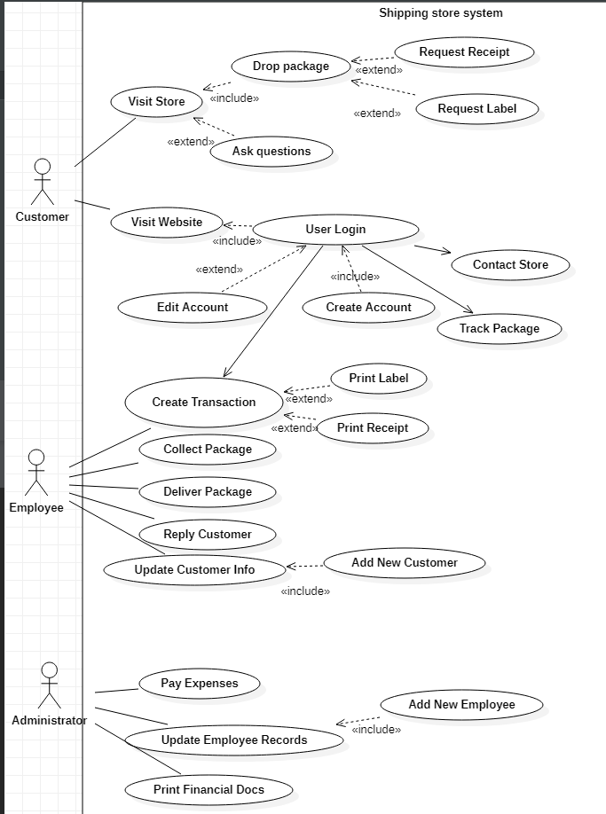

* Use Case 1: Customer Visits Store
  * includes drops package 
  * extends asks question
  * A customer can enter the store, drop off a package, request a label 
  and / or a receipt, and may ask a question. 
* Use Case 2: Customer Visits Website (Login mandatory)
  * includes Create or edit account
  * includes Contact Store 
  * includes Track package 
  * Either a customer or employee can create a transaction
* Use Case: Employee:
  * 3: creates transaction
  * 4: picks up package
  * 5: delivers package
  * 6: replies customer
  * 7: updates customer info (add or edit)
* Use Case: Admin: 
  * 8: Pay expenses
  * 9: Update Employee Records (add or edit)
  * 10: Print Financial Docs

## Task 2 - CRC cards and Class Diagram
### CRC's 

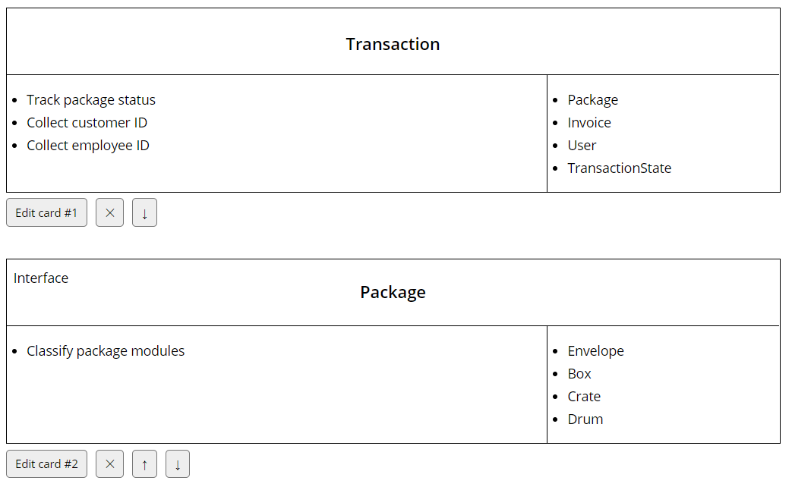

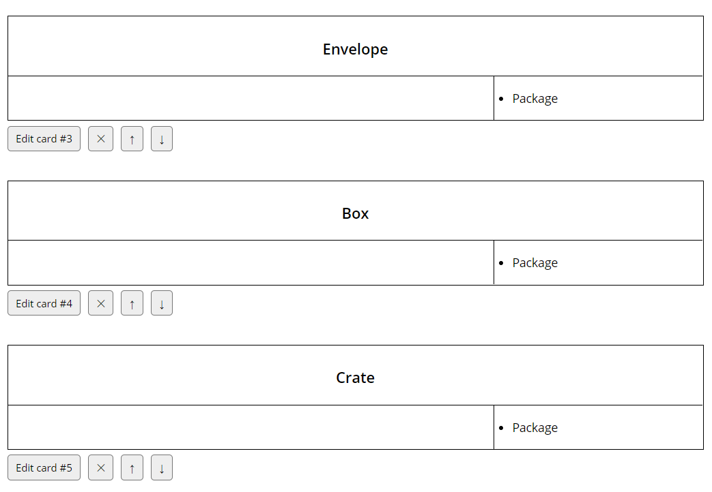

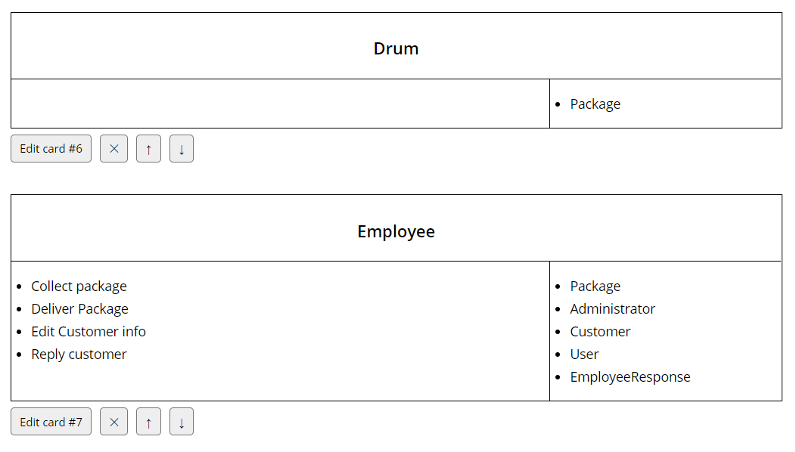

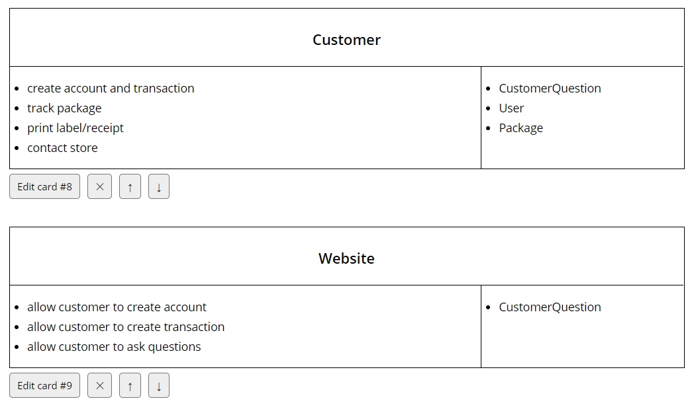

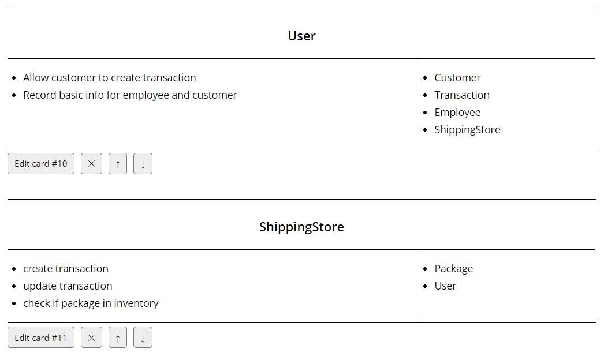

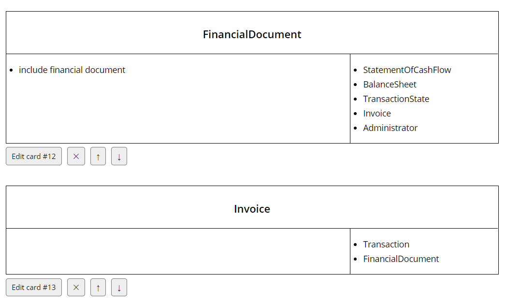

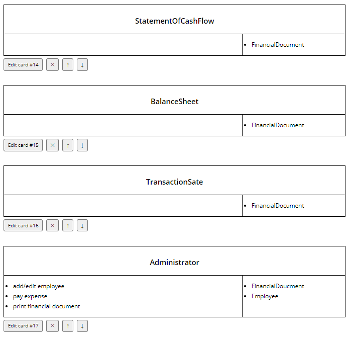

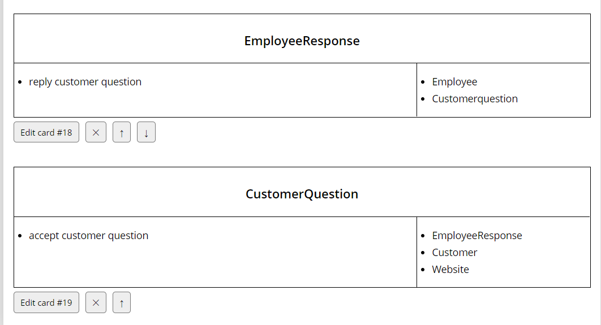

### Class Diagram
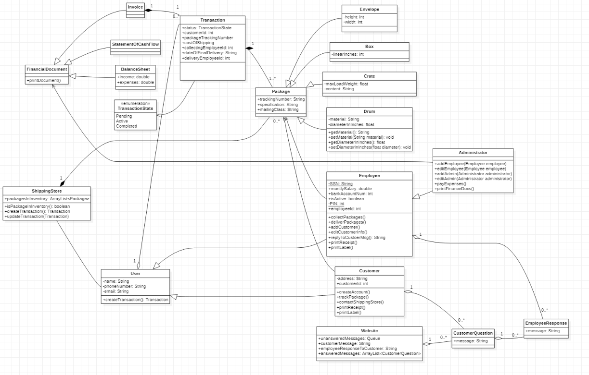

## Task 3 - Sequence Diagram

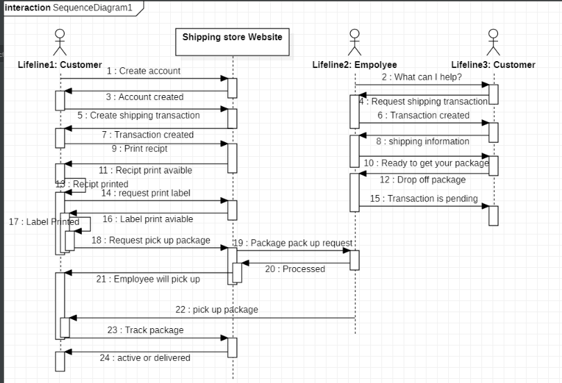

## Task 4 Transactions State Machine Diagram

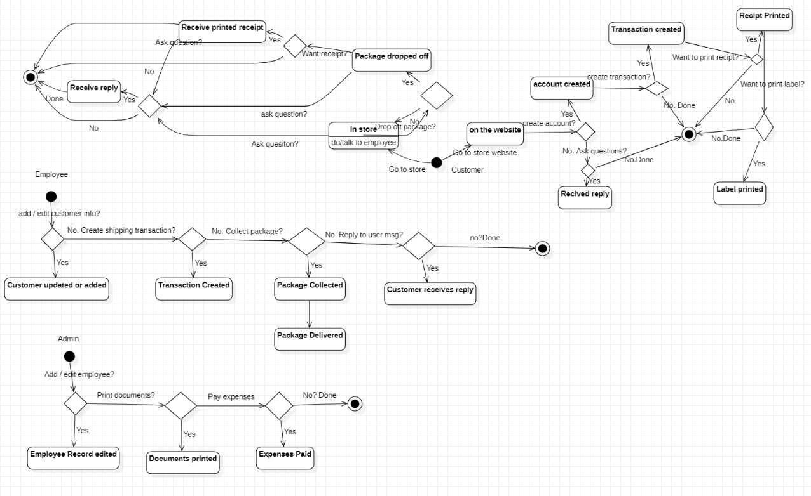

